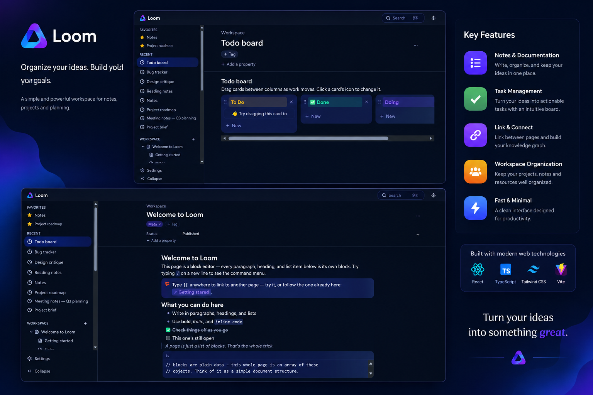

<div align="center">

# Loom

**A calm knowledge workspace — structured pages woven into a living graph of ideas.**

Notion's page structure. Obsidian's connected graph. One product, its own identity.


</div>

---

<div>

</div>
---

## Table of contents

- [What is Loom](#what-is-loom)
- [Features](#features)
- [Tech stack](#tech-stack)
- [Getting started](#getting-started)
- [Project structure](#project-structure)
- [Architecture &amp; design philosophy](#architecture--design-philosophy)
- [Scripts](#scripts)
- [Development roadmap](#development-roadmap)
- [Routes](#routes)
- [Engineering judgment calls](#engineering-judgment-calls)
- [Project status](#project-status)

---

## What is Loom

Most note-taking tools force a choice: organize your thinking into neat, structured
pages — or let it sprawl into a web of connected ideas. **Loom doesn't make you
choose.** Every page is both at once: a structured document you can nest, rename,
and navigate like a filing cabinet, _and_ a node in a graph that grows automatically
as you write and link.

The product brief behind Loom asked for something with the DNA of two well-known
tools — a page-and-workspace model, and a bidirectional linked-graph model —
without cloning either one's interface or branding. What follows is the result:
a from-scratch design system (**Ink/Paper** backgrounds, **Thread Gold**,
**Structure Violet**, **Growth Mint** accents), built up phase by phase, with
every phase's code actually working before the next one started.

> This is a **product engineering exercise built in the open**: every phase below
> shipped a real, runnable app — not a mockup — verified against a build, a
> linter, and a formatter before moving on. The READMEs in `src/features/*/`
> document what's real, what's a deliberate placeholder, and what got
> reconsidered along the way.

## Features

### 🗂️ Workspace &amp; pages

- Nested pages, unlimited depth, created/renamed/deleted from the sidebar or
  from the page itself
- Cascading delete with a confirmation dialog that tells you exactly how many
  sub-pages come with it
- Breadcrumb trail computed live from the page tree — never stored, always
  accurate
- Empty, loading, and "page no longer exists" states everywhere a page might
  legitimately not be there
- **Favorites** — star any page from its actions menu; a dedicated sidebar
  section appears the moment you have at least one
- **Recents** — the last 8 pages you opened, tracked automatically,
  persisted across sessions, surfaced in both the sidebar and the `⌘K`
  palette's empty state

### ⭐ Tags, properties &amp; templates

- Tag any page with existing tags or create new ones inline, right from the
  page header — a type-to-filter picker, not a plain multi-select
- A dedicated Tags gallery shows every tag with its page count; click
  through to every page carrying that tag
- Add typed properties to any page — text, number, date, select, or
  checkbox — the same five types Notion-style property panels use
- Save any page as a reusable template, then start new pages from it — a
  gallery of everything you've saved, one click to use

### ✍️ Block editor

- 12 block types: paragraph, heading 1–3, bulleted/numbered/checklist, quote,
  callout, code, divider, toggle (with nested children), image, table
- `/` opens a filtered slash-command menu right at your cursor
- Real inline formatting — **bold**, _italic_, underline, ~~strikethrough~~,
  `inline code` — typed with familiar Markdown shortcuts (`**like this**`)
- Enter / Backspace / Arrow Up / Arrow Down all move and split blocks the way
  you'd expect from any modern block editor
- Autosave: debounced, optimistic, with a "Saving…/Saved" indicator — and a
  flush-on-navigate so a last-second edit is never silently dropped

### 🔗 Linking &amp; the knowledge graph

- Type `[[` anywhere to link to another page; the link renders as a clickable
  chip, not a raw URL
- Every page automatically shows a **Backlinks** panel — every other page
  that links to it, with one click back
- A full-screen **Graph View** with genuinely live physics — every page is a
  node, every link a directional edge, arranged by a continuous d3-force
  simulation that settles naturally and reheats the moment you drag a node,
  the way Obsidian's graph actually behaves. Pan, zoom (buttons or wheel),
  search-to-highlight, filter by tag, hover a node to see its neighborhood,
  click to open

### ⌘ Search &amp; command palette

- `⌘K` / `Ctrl+K` from anywhere opens a single, unified, keyboard-navigable
  list — no separate "search mode" vs. "command mode"
- Searches page **titles and content** — not just what's already loaded in
  the sidebar
- Doubles as a command runner: create a page, jump to the Graph, jump to
  Settings, toggle the sidebar, toggle the theme
- Typing a name that doesn't match anything offers "Create page '…'" right
  there — no need to close the palette first
- `⌘N` creates a page from anywhere; `⌘S` is safely swallowed so the
  browser's native Save dialog never interrupts typing

### 🎨 Design system &amp; theming

- Light / Dark / System, persisted, zero flash on load
- A from-scratch token system (not shadcn's defaults re-skinned) mapped onto
  Tailwind's `@theme`, so `bg-primary`, `text-muted-foreground`, `bg-brand-violet`
  etc. all just work
- Fully responsive: a collapsible desktop sidebar and a real `<dialog>`-based
  mobile drawer (native focus trap, native Escape-to-close)

### ♿ Accessibility, taken seriously rather than checked off

- Native `<dialog>` for modals and the mobile drawer, native
  `<input type="checkbox">` for checklist items, `role="listbox"`/`"option"`
  (the documented WAI-ARIA pattern) only where a native element genuinely
  can't do the job — e.g. a menu that has to render icon rows and stay
  positioned at a text cursor
- A real skip-to-content link, keyboard-reachable retry buttons on every
  error state, and every color pair in both themes checked against WCAG
  AA's 4.5:1 text-contrast threshold with the actual math, not a guess —
  five token values were quietly failing (as low as 2.97:1) and got
  corrected
- Honest limitations are _documented_, not hidden: the Graph View is a
  visual, spatial diagram with no meaningful screen-reader equivalent — so it
  says so, and points back to the sidebar's page list instead of pretending
  an ARIA role fixes it

### ✨ Polish

- A comfortable, constrained reading width for the page title and editor
  body — full-width text on a wide monitor is exactly what the brief warned
  against
- Toast notifications for actions with no other visible feedback (saving a
  page as a template, for instance)
- Dialogs, the mobile drawer, and dropdown menus animate in and out with
  plain CSS — `@starting-style` for the native `<dialog>`s, `data-state`-keyed
  keyframes for Radix's dropdown — no animation library
- Page-to-page navigation uses the native View Transitions API (via React
  Router's built-in `viewTransition` option) for a soft cross-fade instead
  of an instant swap, with a clean no-op fallback where unsupported
- The Graph View gained tag filtering (deferred from Phase 4 until tags
  existed) and zoom +/− buttons — the latter closes a real gap, since
  pinch-to-zoom was never implemented and the wheel handler never fires on
  touch, so touch users previously had pan but no way to zoom at all
- Every animation and transition added this phase respects
  `prefers-reduced-motion` — checked explicitly, not assumed

## Tech stack

| Layer                 | Choice                                       | Why                                                                                                                                                         |
| --------------------- | -------------------------------------------- | ----------------------------------------------------------------------------------------------------------------------------------------------------------- |
| Build tool            | **Vite 8**                                   | Instant HMR, first-class TS support, the current default for new React projects                                                                             |
| UI                    | **React 19**                                 | Function components can accept `ref` as a normal prop now — no `forwardRef` boilerplate anywhere in this codebase                                           |
| Language              | **TypeScript** (strict)                      | Domain types (`Page`, `Block`, `Link`, …) shared across the UI, state, and API layers                                                                       |
| Styling               | **Tailwind CSS v4**                          | CSS-first `@theme` config — the whole design system lives in one `index.css`, no separate config file                                                       |
| Client state          | **Zustand**                                  | Seven small, single-purpose stores instead of one giant one — see [Architecture](#architecture--design-philosophy)                                          |
| Routing               | **React Router 8**                           | v8 folded `react-router-dom` into the main package, which also happened to clear a CVE that affected the dom package at the time                            |
| HTTP                  | **Axios**                                    | One centralized client with interceptors — no component ever imports it directly                                                                            |
| Rich text             | **Tiptap**                                   | Battle-tested ProseMirror wrapper — hand-rolling contentEditable behavior (cursor handling, IME, paste) is its own multi-week project even at big companies |
| Graph layout          | **d3-force**                                 | Just the physics engine, not the rest of D3 — a hand-rolled force simulation risks looking janky; this one is proven                                        |
| Drag and drop         | **@dnd-kit** (core, sortable, utilities)     | The active, maintained successor to react-beautiful-dnd (archived); powers the board block's cards/columns, the page tree, and block reordering             |
| Accessible primitives | **Radix UI** (Slot, Dropdown Menu)           | Correct keyboard behavior for a real menu (arrow keys, typeahead, focus return) is a much bigger lift to hand-roll than it looks                            |
| Component conventions | **shadcn/ui-style, hand-built**              | `components.json` is in place so a real `npx shadcn add` drops in cleanly the moment this environment can reach `ui.shadcn.com`                             |
| Linting               | **oxlint**                                   | Vite's own current default, far faster than ESLint, and its native `--jsx-a11y-plugin` covers accessibility linting without a second tool                   |
| Testing               | **Vitest** + Testing Library                 | Shares Vite's config and transform pipeline directly — no separate Jest/Babel setup to keep in sync                                                         |
| Formatting            | **Prettier** + `prettier-plugin-tailwindcss` | Class lists sorted automatically, zero bikeshedding                                                                                                         |

## Getting started

```bash
npm install
npm run dev       # start the dev server, then open the printed localhost URL
npm run test      # run the Vitest suite once
npm run typecheck # tsc, strict mode
npm run lint      # oxlint
```

There's no backend to stand up — see [Architecture](#architecture--design-philosophy)
for how that works. The app seeds itself with a starter workspace (10 pages
across a couple of small hierarchies, tags, page properties, and 5
templates) on first run, stored in your browser's `localStorage`. If it
ever looks empty or stuck from experimenting with import, Settings has a
"Reset to demo content" button — no need to clear storage by hand.

## Project structure

```text
src/
├── api/                 # The only layer allowed to touch persistence directly
│   ├── client.ts         #   Centralized Axios instance + interceptors
│   ├── _mockDb.ts         #   localStorage-backed mock "database" + seed data
│   ├── pages.ts, blocks.ts, links.ts, workspaces.ts, search.ts,
│   │   tags.ts, pageProperties.ts, templates.ts
│                          #   Domain modules — same async shape a real API would have
├── components/
│   ├── EmptyState.tsx     #   Shared across every "nothing here yet" screen
│   └── ui/                #   Hand-built shadcn/ui-style primitives (Button, Dialog, …)
├── features/              # Feature-first — each owns its components + a README
│   ├── workspace/          #   Page tree, Favorites, Recents
│   ├── pages/               #   Page-entity UI: header, tags, properties, actions menu
│   ├── editor/               #   The block editor — by far the largest feature
│   ├── graph/                 #   Force-directed Graph View
│   ├── search/                 #   The ⌘K command palette
│   ├── settings/, templates/
│                                #   Scaffolded now, templates built out in Phase 6
├── hooks/                  # useMediaQuery, useTheme, useDialogElement, useGlobalShortcuts
├── layouts/                # AppShell, Sidebar, Topbar
├── lib/                    # Pure functions: tree.ts, blocks.ts, utils.ts
│                             #   (page tree, block ordering, and link extraction are all
│                             #   *derived views* computed here — never stored nested)
├── routes/                 # One file per route (see the Routes table below)
├── stores/                 # Seven Zustand stores, one responsibility each
├── types/                  # entities.ts — the shared domain model
├── index.css                # The entire design system: tokens, both themes, base layer
├── App.tsx                  # Route table
└── main.tsx                 # Entry point
```

## Architecture &amp; design philosophy

**There's no real backend, on purpose, and every layer is written as if there
were one.** `api/pages.ts`, `api/blocks.ts`, and `api/links.ts` expose plain
`async` functions with the exact shape a real REST call would have. Underneath,
they read and write a small JSON "database" in `localStorage`
(`api/_mockDb.ts`) with a simulated network delay, so loading states get
exercised honestly instead of resolving instantly every time. The day a real
backend exists, only those three files change — nothing else in the app
knows the difference.

**Derived data is never stored twice.** This is the single idea that shows up
most often across the codebase:

- The page **tree** isn't stored nested — it's computed from a flat
  `pagesById` map by `lib/tree.ts`, every render
- **Backlinks** aren't their own table — they're `Link` records filtered by
  `targetPageId`, computed in `api/links.ts`
- The **Graph View**'s nodes and edges aren't stored either — they're pages
  and links, laid out live by a `computeGraphLayout.ts` simulation

Store it once, derive everything else. It means renaming a page, deleting a
block, or forming a new link can never leave two copies of the truth out of
sync with each other, because there's only ever one copy.

**State is split by who actually needs it.** Seven Zustand stores
(`useSettingsStore`, `useSidebarStore`, `useWorkspaceStore`, `usePageStore`,
`useEditorStore`, `useSearchStore`, `useTagStore`) instead of one big one —
so a component that only cares about the theme doesn't re-render when a
block's text changes three pages away. Purely local, single-component UI
state (a graph's current zoom level, a command palette's current query)
stays in `useState`, not Zustand — both `useGraphStore` (Phase 4) and half of
`useSearchStore` (Phase 5) started out planned as global state and got
pared back once the real feature showed that state was ephemeral and
single-consumer after all.

**Every phase shipped something you could actually click on.** The roadmap
below isn't a plan that got abandoned once coding started — each phase's
commit genuinely builds, lints, and formats clean before the next one began,
and the honest gaps (a feature intentionally deferred, a small bug caught
mid-phase) are called out explicitly in this README and in
`src/features/*/README.md`, not smoothed over.

## Scripts

| Script                 | Does what                                           |
| ---------------------- | --------------------------------------------------- |
| `npm run dev`          | Vite dev server with HMR                            |
| `npm run build`        | Type-check (`tsc -b`) + production build            |
| `npm run preview`      | Serve the production build locally                  |
| `npm run lint`         | oxlint (react + typescript + jsx-a11y plugins)      |
| `npm run format`       | Prettier — write                                    |
| `npm run format:check` | Prettier — check only (used as a verification gate) |

All three gates (`build`, `lint`, `format:check`) pass clean as of this
commit, and `npm audit` reports 0 vulnerabilities.

## Development roadmap

| Phase | Focus                                                          | Status                 |
| ----- | -------------------------------------------------------------- | ---------------------- |
| 1     | Foundation — tooling, theme system, base layout                | ✅ Done                |
| 2     | Workspace — real pages, tree, nesting, CRUD                    | ✅ Done                |
| 3     | Editor — blocks, slash commands, formatting, autosave          | ✅ Done                |
| 4     | Knowledge Graph — `[[links]]`, backlinks, graph view           | ✅ Done                |
| 5     | Search — search index, `⌘K` command palette                    | ✅ Done                |
| 6     | Productivity — favorites, recents, tags, templates, properties | ✅ Done _(this phase)_ |
| 7     | Polish — responsive pass, animation, a11y, performance         | ✅ Done _(this phase)_ |

## Routes

| Route                          | Renders                                                |
| ------------------------------ | ------------------------------------------------------ |
| `/`                            | Redirects to `/w/default`                              |
| `/w/:workspaceId`              | Workspace root — empty state or new-page CTA           |
| `/w/:workspaceId/p/:pageId`    | Full page: header, tags, properties, editor, backlinks |
| `/w/:workspaceId/graph`        | Real, interactive knowledge graph                      |
| `/w/:workspaceId/tags/:tagId?` | Tag gallery, or pages filtered by one tag              |
| `/w/:workspaceId/templates`    | Template gallery — use or delete                       |
| `/settings/:tab?`              | Settings — Appearance is real                          |

## Engineering judgment calls

A running list of decisions made along the way that deviated from the
original brief or from the obvious default, and why:

- **`src/routes/`** instead of a top-level `pages/` — the original folder
  sketch had both `features/pages/` (the Page _entity_) and a top-level
  `pages/` (routed _screens_), which collide in name and meaning
- **`react-router@8.3.0`** instead of `react-router-dom` — v8 absorbed the
  dom package into the main export, and it happens to be the version that
  clears a high-severity CVE that affected `react-router-dom` at the time
- **oxlint** instead of ESLint — Vite's own current default, faster, and its
  native `jsx-a11y` plugin covers accessibility linting without a second tool
- **Native `<dialog>`** for the mobile drawer and confirmation dialogs
  instead of `@radix-ui/react-dialog` — a real top-layer modal with a free
  focus trap and native Escape-handling, no extra dependency needed for
  something this contained
- **`@radix-ui/react-dropdown-menu` was added**, unlike the dialog above —
  correct keyboard behavior for a real menu (arrow keys, typeahead, focus
  return) is a much bigger lift to get right by hand
- **`d3-force` was added**, but not the rest of D3 or `d3-zoom` — proven
  physics matters for a graph people can drag around, while pan/zoom is
  simple enough to hand-roll as plain SVG transforms
- **The graph layout ran once (300 ticks) and froze, until it didn't** —
  originally deliberate ("a graph that visibly jitters into place reads as
  unfinished"), reversed after an explicit request for Obsidian-like
  behavior, where continuous physics and draggable nodes are the actual
  point, not an unfinished-looking side effect. Position updates during
  the simulation are imperative (direct `setAttribute` calls in the tick
  callback via element refs), not `setState` — the standard pattern for
  60fps d3 animation inside React without a full re-render on every tick
- **Wikilink insertion reuses the slash-menu's own trigger-detection
  technique** (watching plain text on `onUpdate`) rather than Tiptap's
  official Suggestion/Mention extensions — one less API surface, and `[[`
  needs to trigger mid-sentence, which the simpler approach handles fine
- **A wikilink chip's label snapshots the page title at insertion time** —
  renaming the target page didn't retroactively update chips elsewhere that
  already pointed to it. Was documented as a known limitation, not silently
  accepted; fixed in a later addition — see "Project status" below for what
  changed and why it wasn't fixed by making the chip do a live lookup instead
- **Drag-and-drop reordering and a workspace switcher weren't in the
  original 7 phases** — the general brief mentions drag-and-drop alongside
  things that _are_ built, but the phase-by-phase roadmap never actually
  placed it anywhere (favorites and recents, also brief-mentioned, did land
  in Phase 6); building ahead of the plan wasn't the goal at the time. Drag
  and drop was added later — see "Project status" below for what changed;
  a workspace switcher remains genuinely out of scope, not just deferred
- **The Graph View is honestly not very screen-reader-accessible** —
  force-directed node-link diagrams are a well-known hard case industry-wide;
  a `sr-only` note points back to the sidebar's page list rather than
  pretending an ARIA attribute solves a fundamentally spatial interface
- **No fuzzy-search library was added** (no Fuse.js, no MiniSearch) — plain
  case-insensitive substring matching over page titles and block text is
  enough at this scale, and it's one fewer dependency to justify
- **`useSearchStore` lost fields instead of gaining them this phase** — see
  [Architecture](#architecture--design-philosophy). The original Phase 1
  skeleton had `query` as global state; the real palette only needed
  `isCommandPaletteOpen` to be shared
- **The command palette merges commands and page search into one list**
  rather than separate "command mode" and "search mode" tabs — fewer modes
  to explain, and it's what most people expect from `⌘K` these days
- **`usePageStore` picked up `persist` middleware for one field** —
  `recentPageIds` is the only part of that store worth surviving a page
  refresh; `pagesById` always gets re-fetched fresh, so persisting it too
  would just be a second, staler copy of the truth
- **"Select" properties share one generic preset option list** rather than
  each property defining its own choices — `PageProperty` (Phase 0 data
  model) never got an options schema, and adding one felt like real scope
  creep for what's meant to be a basic property editor, not a database
  builder
- **Templates only capture a page's top-level blocks** — `Template.blocks`
  has no parent-child shape, so a toggle's nested children don't survive
  being saved into a template. Documented in `features/templates/README.md`
  rather than silently dropped
- **Tag colors are auto-assigned** from a fixed 3-color rotation instead of
  a color picker — one less decision when creating a tag, and the three
  brand hues (gold/violet/mint) already carry meaning elsewhere in the app
- **The tag picker stays open after each pick** (existing or newly created)
  instead of closing immediately — adding three tags shouldn't mean
  reopening the same menu three times
- **Tag filtering in the Graph View, deferred in Phase 4, got built this
  phase instead of staying deferred** — the reason it was deferred (tags
  didn't exist yet) no longer applied once Phase 6 shipped, and "polish"
  reasonably includes finishing something that was blocked, not just
  refining what already shipped
- **`BlockRow`'s Zustand subscription is scoped to a derived boolean**
  rather than the whole `blocksById` map — a concrete, evidence-based fix
  (every block on a page was re-rendering on every keystroke typed into any
  one of them), not speculative optimization for a problem that might not
  exist
- **Color contrast got the actual math, not a re-eyeball** — computing real
  WCAG relative luminance found five token values quietly failing 4.5:1 in
  ways that "looks fine to me" wouldn't have caught, particularly
  `text-faint` in light mode at 2.97:1, well under even the relaxed 3:1
  large-text floor
- **View transitions use React Router's built-in `viewTransition` option**
  instead of hand-rolling `document.startViewTransition()` calls — v8
  already wraps the native API with correct fallback behavior baked in
- **The toast system is deliberately small** — one queue, one auto-dismiss
  timer, bottom-right stack. It exists to fill a real gap (saving a page as
  a template had zero feedback), not to become a general-purpose
  notification center nothing else currently needs

## Project status

All seven phases in the original roadmap are built, and the same four
gates (`build`, `lint`, `format:check`, `test`) have passed clean at the
end of every single one — this README's git history (if you're looking at
commits rather than just this file) is effectively a changelog of that.

Genuinely out of scope for what got built, not just deferred to a phase
that hasn't arrived yet:

- **A real backend** — every `api/*.ts` module is written to the exact
  shape a real HTTP call would have specifically so this swap is
  contained; it just hasn't been asked for yet
- **Multi-user collaboration** — presence, live cursors, concurrent editing
  conflict resolution — a substantial project of its own, not a phase
- **A workspace switcher** — this build has always been single-workspace by
  design

**Added later, beyond the original 7 phases:** a "board" block type
(Kanban, `@dnd-kit`); workspace export/import as JSON plus a one-click
"reset to demo content"; 8 built-in templates (including two board-based
ones) shown as a visual gallery of schematic previews rather than a plain
list; drag-and-drop reordering for pages (with re-parenting) and blocks,
replacing the original move-up/move-down-only design, with full keyboard
support (`KeyboardSensor`) alongside pointer/touch on every drag surface;
real file upload for images (data URI, since there's still no backend);
ARIA heading semantics for the editor's heading blocks (`role="heading"` +
`aria-level`, since they're styled paragraphs under the hood, not real
`<h1>`-`<h6>` elements); the wikilink-staleness fix mentioned above;
TypeScript strict mode, actually turned on this time; and a Vitest suite
(112 tests as of the last addition) covering the pure `lib/` functions,
the mock API layer's CRUD/cascade-delete/reorder behavior, and several
specific race conditions and bugs found and fixed along the way — each one
confirmed by reverting the fix and watching its test fail, not just
written to match whatever the fixed code already did.

If you made it this far: thanks for reading a README this thorough. It
tries to model the same value the app itself is built around — nothing here
should require you to guess.
